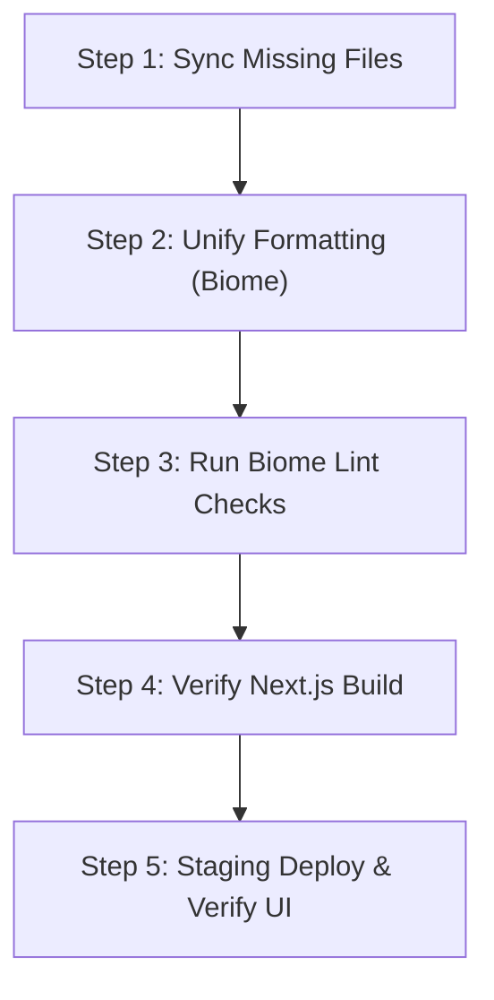

# UI Merge Readiness & Integration Plan (RC1)

This report outlines the step-by-step procedure required to cleanly integrate the newly recovered UI components into the production architecture repository.

## 1. Overall Merge Readiness
The UI codebase is structurally **ready for integration**, provided that:
1. **Missing logical dependency files** (Purchase Staging tables, Excel uploader backend, Odoo webhook sync scripts) currently isolated in the inner repository are synchronized with the outer workspace.
2. **Whitespace and formatting differences** (Tabs vs Spaces) are resolved prior to staging the merge to prevent massive git diff conflicts.

---

## 2. Step-by-Step Integration Guide



### Step 1: Copy Isolated Files
Before merging, copy the purchase parser, profitability calculator, webhook endpoints, and related migration scripts from the inner repository to the outer directory:
* **Target Files**:
  * `src/lib/business-logic/purchase.ts`
  * `src/lib/business-logic/profitability.ts`
  * `src/lib/business-logic/margin.ts`
  * `src/lib/founder/purchase-import-service.ts`
  * `src/lib/parser/purchase-parser.ts`
  * `src/app/api/webhooks/odoo/`
  * `src/scripts/migrate-purchase-fact.ts`
  * `src/scripts/seed-purchase-from-excel.ts`
  * `src/scripts/migrate-odoo-webhook-tables.ts`

### Step 2: Resolve Indentation (Spaces vs Tabs)
Since the outer workspace uses Tab-indentation (Biome default) and the inner clone uses Space-indentation, run Biome format write on the entire source to convert everything to tabs:
```bash
npm run format
```

### Step 3: Run Biome Lint Checks
Ensure no compiler warnings or Biome hook issues remain:
```bash
npm run lint
```

### Step 4: Perform Production Build Verification
Build the Next.js bundle to verify type safety and compilation:
```bash
npm run build
```

### Step 5: Stage and Deploy
Deploy the clean codebase to staging and verify that the Sales Dashboard, Store Overview, and Customer Retention sections operate correctly with no 404 errors.
